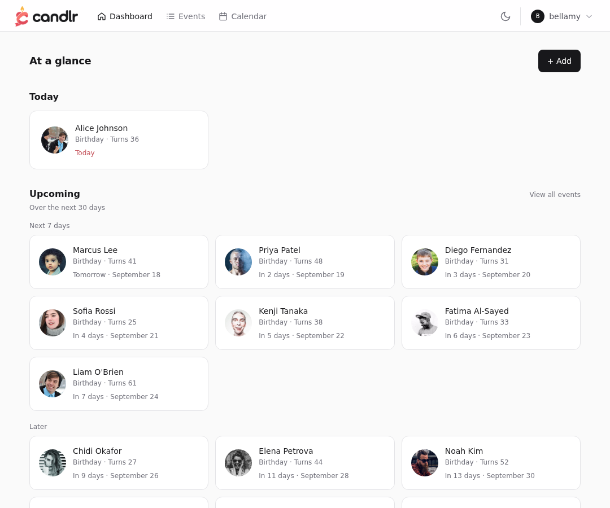
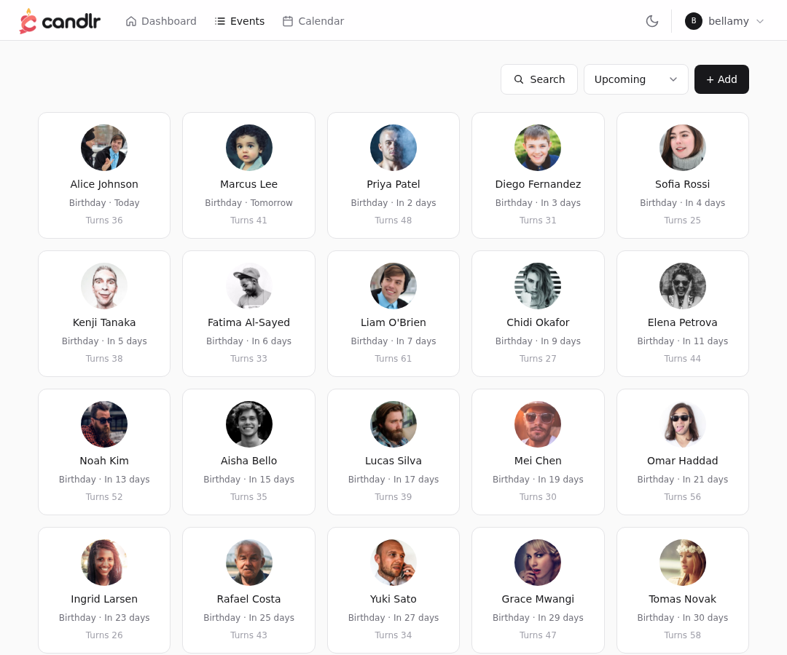
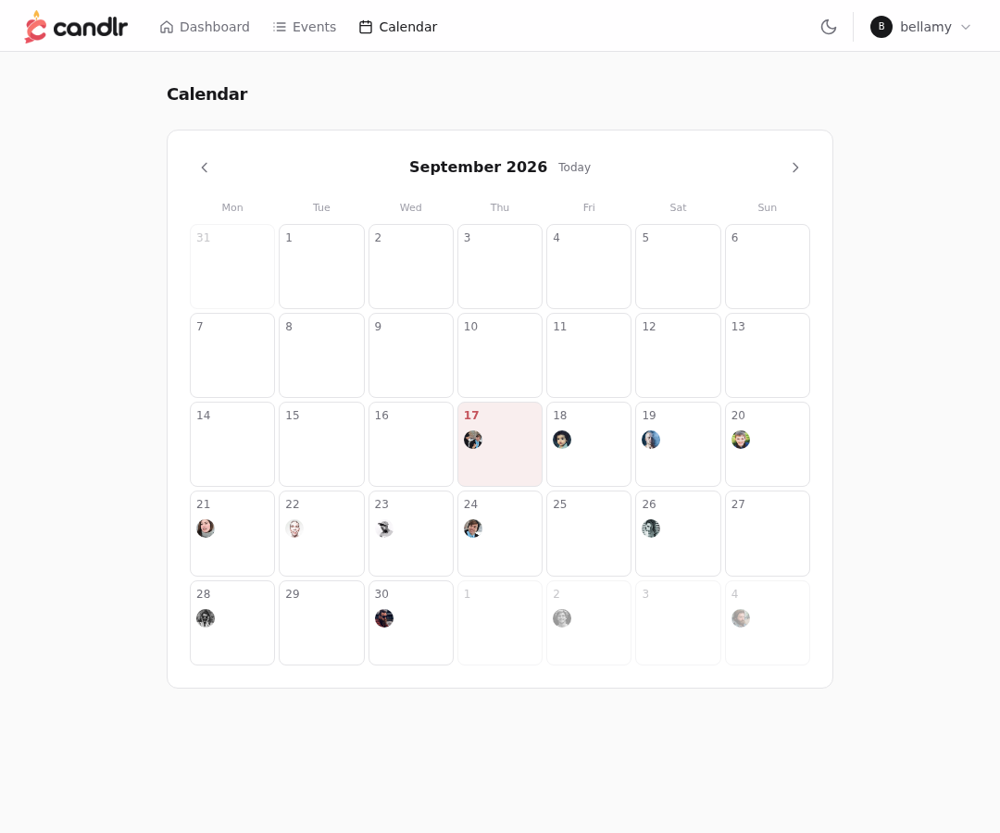
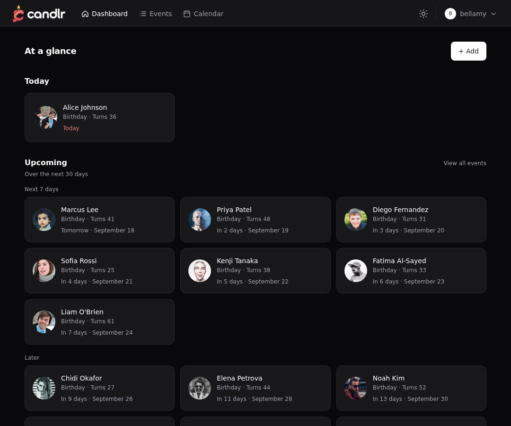
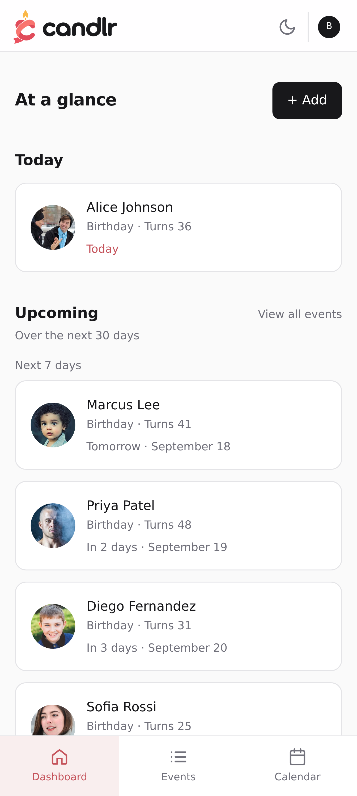
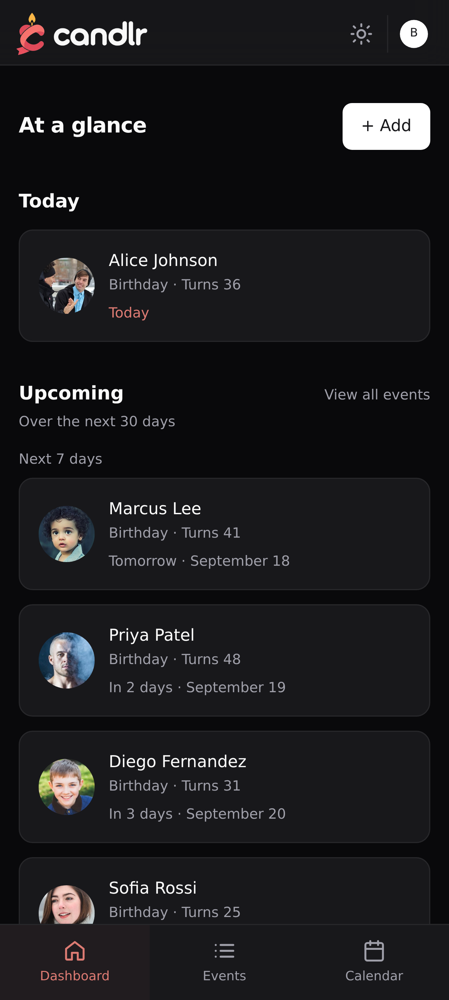
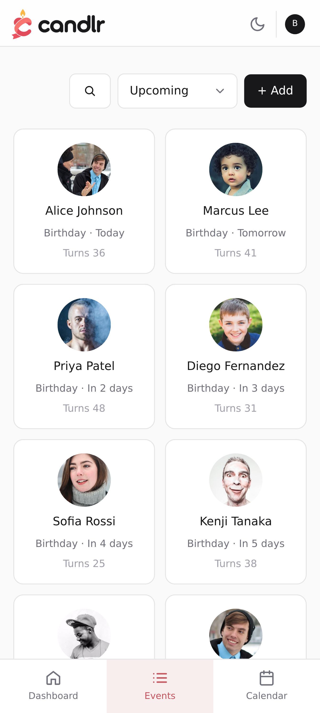
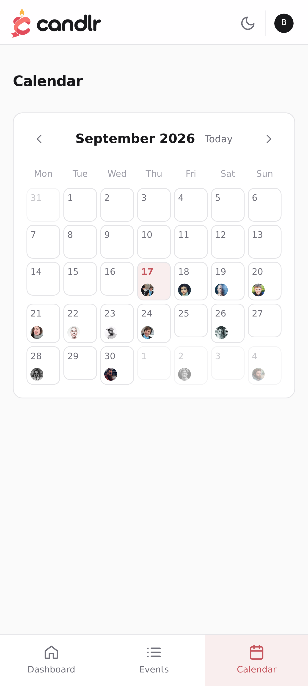

<div align="center">
  
  <h1>Candlr</h1>
  <p>Open-source, self-hosted birthday calendar.</p>

  [](https://github.com/ellite/candlr/stargazers)
  [](https://hub.docker.com/r/bellamy/candlr)
  [](https://github.com/ellite/candlr/graphs/contributors)
  [](https://github.com/sponsors/ellite)
  [](https://github.com/ellite/candlr/releases/latest)
  [](https://github.com/ellite/candlr/actions/workflows/release.yml)
</div>

---

Candlr keeps track of everyone's birthdays in one place, so you never miss one again. Ships as a single Docker container with SQLite - no external database to manage.

## Table of Contents

- [Features](#features)
- [Screenshots](#screenshots)
- [Getting Started](#getting-started)
  - [Docker Compose](#docker-compose)
  - [Docker Run](#docker-run)
  - [First Setup](#first-setup)
  - [Updating](#updating)
- [Configuration](#configuration)
- [OIDC / Single Sign-On](#oidc--single-sign-on)
- [Two-factor authentication](#two-factor-authentication)
- [Notifications](#notifications)
- [Data](#data)
- [Development](#development)
- [Contributing](#contributing)
- [Contributors](#contributors)
- [License](#license)

## Features

- **Track anyone's birthdays, anniversaries, or your own event types**: Each card can hold several dates (a birthday and a wedding anniversary on the same card, for example). Add a photo by upload or by pasting an image URL, then zoom and reposition it with the built-in crop editor before saving. Notes support Markdown. The year is optional, if you don't know or don't want to record it, Candlr just tracks the month and day.
- **OIDC / SSO**: Sign in with any OpenID Connect provider (Authelia, Authentik, Keycloak, etc.), with optional auto-created accounts.
- **Notification channels**: Email, ntfy, Discord, Telegram, Pushover, and browser/device push, configured per account from the settings page, each with a "send test" button, plus an automatic reminder on the day itself.
- **Dark / light theme**: Follows your system preference by default, with a manual toggle in the nav bar and on the login/register pages.
- **SQLite storage**: A single file database - no separate database container to run or maintain.
- **Single container**: Frontend and backend ship together - no separate services to manage.

## Screenshots



<details>
<summary>View more screenshots</summary>

**Events**


**Calendar**


**Dashboard (dark)**


**Dashboard (mobile)**


**Dashboard (mobile, dark)**


**Events (mobile)**


**Calendar (mobile)**


</details>

## Getting Started

### Prerequisites

- [Docker](https://docs.docker.com/get-docker/) and [Docker Compose](https://docs.docker.com/compose/install/)

> Images are hosted on **Docker Hub** (`bellamy/candlr`). A mirror is also available on GHCR (`ghcr.io/ellite/candlr`) if you prefer.

### Docker Compose

1. Download the compose file:

```bash
curl -o docker-compose.yml https://raw.githubusercontent.com/ellite/candlr/main/docker-compose.yml
```

2. Generate a secret key and set it in `docker-compose.yml`:

```bash
# Python
python3 -c "import secrets; print(secrets.token_hex(32))"

# OpenSSL
openssl rand -hex 32
```

```yaml
services:
  candlr:
    image: bellamy/candlr:latest
    container_name: candlr
    restart: unless-stopped
    ports:
      - "4258:4258"
    environment:
      - PUID=1000
      - PGID=1000
      - SECRET_KEY=changeme   # ← generate with: openssl rand -hex 32
      - TIMEZONE=America/New_York   # ← IANA name; defaults to UTC
    volumes:
      - ./data:/app/backend/data
```

3. Start:

```bash
docker compose up -d
```

### Docker Run

```bash
docker run -d \
  --name candlr \
  --restart unless-stopped \
  -p 4258:4258 \
  -e PUID=1000 \
  -e PGID=1000 \
  -e SECRET_KEY="$(openssl rand -hex 32)" \
  -e TIMEZONE=America/New_York \
  -v ./data:/app/backend/data \
  bellamy/candlr:latest
```

### First Setup

1. Open `http://localhost:4258` in your browser.
2. Register an account - all data is local to your instance.

### Updating

```bash
docker compose pull && docker compose up -d
```

Database migrations run automatically on startup - no manual steps required.

## Configuration

| Variable | Default | Description |
|---|---|---|
| `SECRET_KEY` | - | **Required.** JWT signing and 2FA secret encryption key. Keep stable and backed up. Generate with `openssl rand -hex 32`. |
| `PUID` | `1000` | User ID to run the process as. |
| `PGID` | `1000` | Group ID to run the process as. |
| `COOKIE_SECURE` | `false` | Set to `true` when serving over HTTPS, so the auth cookie is marked secure. |
| `DOCS_ENABLED` | `false` | Set to `true` to expose `/docs` and `/redoc` on the backend. |
| `ENABLE_REGISTRATIONS` | `false` | The very first account can always be created; this gates every account after that. |
| `REGISTRATION_MAX_ALLOWED_USERS` | `0` | `0` means unlimited. Only checked when `ENABLE_REGISTRATIONS` is true. |
| `BACKEND_PORT` | `8000` | Internal port the backend binds to. Override only if `8000` conflicts on bare metal. |

See [OIDC / Single Sign-On](#oidc--single-sign-on) and [Notifications](#notifications) below for those variables.

## OIDC / Single Sign-On

Candlr can authenticate against any OpenID Connect provider (Authelia, Authentik, Keycloak, and similar) instead of, or alongside, local password accounts.

1. Register Candlr as a client/application with your provider, with the redirect URI set to `http://your-server:4258/oidc-callback`.
2. Set the following environment variables:

| Variable | Default | Description |
|---|---|---|
| `OIDC_ENABLED` | `false` | Turns on the "Sign in with ..." button on the login page. |
| `OIDC_PROVIDER_NAME` | `SSO` | Shown on the login button, e.g. "Sign in with Authentik". |
| `OIDC_CLIENT_ID` | - | From your provider. |
| `OIDC_CLIENT_SECRET` | - | From your provider. |
| `OIDC_AUTH_URL` | - | The provider's authorization endpoint. |
| `OIDC_TOKEN_URL` | - | The provider's token endpoint. |
| `OIDC_USERINFO_URL` | - | The provider's userinfo endpoint. |
| `OIDC_REDIRECT_URL` | `http://localhost:4258/oidc-callback` | Must match what's registered with the provider. |
| `OIDC_IDENTIFIER_FIELD` | `email` | Field in the userinfo response used to match/create the local account. |
| `OIDC_SCOPES` | `openid email profile` | |
| `OIDC_AUTO_CREATE_USERS` | `true` | If `false`, only users who already exist locally can sign in via SSO. |
| `OIDC_DISABLE_PASSWORD_LOGIN` | `false` | Hides the username/password form entirely; login and register become SSO-only. |

The first person to sign in, local or via OIDC, becomes the instance admin.

## Two-factor authentication

Accounts with a local password can enable authenticator-app 2FA under **Settings > Two-factor authentication**. Confirm your password, scan the QR code (or enter the setup key manually), and confirm the six-digit code. Save the ten single-use recovery codes before leaving setup. Settings also lets you replace recovery codes or turn off 2FA using your password and an authenticator or recovery code.

Both password and SSO sign-in require the second step when Candlr 2FA is enabled. SSO-only accounts manage their second factor with their identity provider. Password reset does not remove 2FA. Enabling or disabling 2FA signs out other sessions.

Setup expires after ten minutes and sign-in challenges after five minutes. Five failed verification attempts lock further attempts for five minutes. Authenticator codes cannot be reused. TOTP follows [RFC 6238](https://www.rfc-editor.org/rfc/rfc6238) through [PyOTP](https://pyauth.github.io/pyotp/).

Authenticator secrets are encrypted using a key derived from `SECRET_KEY`; recovery codes and login challenges are stored hashed. Keep `SECRET_KEY` stable and backed up with your database. Changing it makes stored authenticator secrets unreadable. Serve the app over HTTPS and enable `COOKIE_SECURE` in production.

## Notifications

Each account can configure its own notification channels from the settings page, plus what time of day to be notified (always on the day itself) and, per date, whether to notify for it at all. The reminder worker checks every minute in `TIMEZONE` and sends one message per enabled date on every enabled channel. It catches up later the same day after downtime, but does not send reminders from previous days. Delivery history in SQLite prevents routine repeat sends across restarts; failed channels retry after 5, 10, 20, 40, then 60 minutes, only while still eligible that day. A crash after a provider accepts a message but before success is recorded can still cause a duplicate. Web push follows the existing channel behavior: delivery to any subscribed device counts as channel success.

Docker starts the worker automatically under supervisord after migrations. For local development, run `alembic upgrade head`, then `python -m app.reminders` from `backend/` alongside the API and frontend.

- **Email** and **device (browser push)** need instance-wide setup (below) before any account can use them. Everything else is entirely self-serve from the settings page.
- **ntfy**, **Discord**, **Telegram**, and **Pushover** need nothing from you as the admin; each user pastes in their own topic/webhook/bot/app details.

| Variable | Default | Description |
|---|---|---|
| `SMTP_ADDRESS` | - | Your SMTP relay's hostname. Leave unset to disable the email channel entirely. |
| `SMTP_PORT` | `587` | |
| `SMTP_ENCRYPTION` | `tls` | `tls`, `ssl`, or `none`. |
| `SMTP_USERNAME` / `SMTP_PASSWORD` | - | |
| `FROM_EMAIL` | - | Falls back to `SMTP_USERNAME`, then `candlr@localhost`. |
| `SERVER_URL` | `http://localhost:4258` | Used to build the link inside the password reset email. Set this to your real external URL. |
| `TIMEZONE` | `UTC` | IANA name (e.g. `America/New_York`). Determines "today" for the dashboard and the local time used for reminders. |
| `VAPID_PUBLIC_KEY` / `VAPID_PRIVATE_KEY` | - | Required for the device-notifications (web push) channel. Generate a pair with: |

```bash
docker exec candlr python3 /app/backend/scripts/generate_vapid_keys.py
```

(or, in a local dev checkout: `cd backend && python3 scripts/generate_vapid_keys.py`)

Setting `SMTP_ADDRESS` also turns on **forgot/reset password**: a "Forgot password?" link appears on the login page, and it sends a reset link through the same SMTP relay. Leave it unset and that link simply doesn't appear.

## Data

All data is stored under `./data`: the SQLite database at `./data/candlr.db`, and any uploaded or fetched photos under `./data/images/`. Back up the whole `data/` directory to preserve your birthdays and photos together.

The `data/` directory is a bind mount, so it persists across container rebuilds and restarts.

| Port | Service |
|------|---------|
| 4258 | Candlr web UI |

The backend API is internal-only and not exposed outside the container.

## Development

<details>
<summary>View instructions</summary>

### Requirements

- Python 3.12+
- Node.js 22+

### Backend

```bash
cp .env.example .env   # in the repo root - then edit .env, at minimum set SECRET_KEY
cd backend
pip install -r requirements.txt
alembic upgrade head
uvicorn app.main:app --reload --port 8000
```

### Frontend

```bash
cd frontend
npm install
API_URL=http://localhost:8000 npm run dev
```

The frontend dev server starts on `http://localhost:4258` and proxies API calls to the backend on port `8000`.

</details>

## Contributing

Contributions are welcome - whether it's a bug report, a feature request, or a pull request.

- **Issues**: Open an issue for bugs, questions, or feature ideas.
- **Pull Requests**: Fork the repo, create a branch, and submit a PR. Please follow the existing code style (Astro components for the frontend, FastAPI for the backend).

Commit messages follow [Conventional Commits](https://www.conventionalcommits.org/) - `feat:`, `fix:`, `chore:` - as releases and changelogs are generated automatically from them.

## Contributors

<a href="https://github.com/ellite/candlr/graphs/contributors">
  
</a>

## License

Candlr is licensed under the [GNU General Public License v3.0](LICENSE.md).

You are free to use, modify, and distribute Candlr, provided that any derivative works are also released under the GPLv3.
